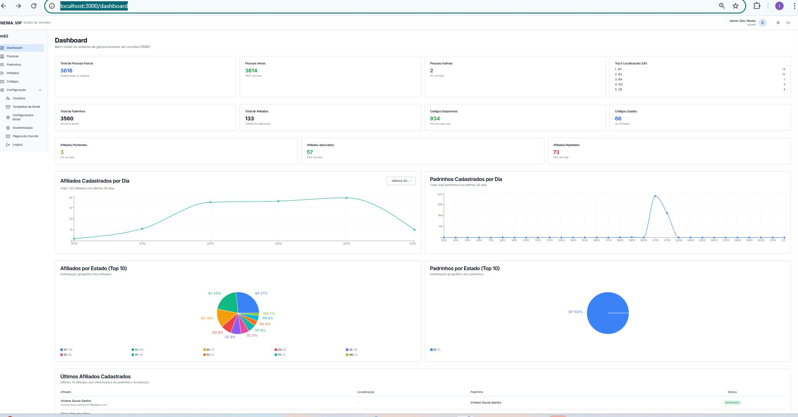

# 📚 Documentação do Projeto - Sistema de Convites NM82

**Última Atualização:** 02/11/2025

---

## 📋 Índice Rápido

### 🎯 Planejamento
- [PRD - Visão Geral](prd.md)
- [Requisitos Funcionais](prd/requisitos-funcionais.md)
- [Integrações](prd/integracoes.md)

### 🏗️ Arquitetura
- [**RF-003 e RF-004: Fluxo de Aprovação**](arquitetura/fluxo-aprovacao-rf-003-004.md) ⭐ NOVO
- [**Resumo Executivo**](arquitetura/RESUMO-EXECUTIVO.md) ⭐ NOVO

### 🔧 Guias de Desenvolvimento
- [Retomar Rápido](../.ai/RETOMAR-RAPIDO.md) - Como iniciar após pausa
- [Sessão 02/11/2025](../.ai/SESSAO-02-11-2025.md) - Documentação da sessão atual

---

## 🎯 Documentos por Fase

### ✅ Fase 1 (Completa)
- [x] Dashboard Administrativo
- [x] Autenticação e Autorização
- [x] Sistema de Usuários (ADMIN/EDITOR/VIEWER)
- [x] Métricas de Pessoas Físicas

### 🔄 Fase 2 (Em Planejamento)
- [ ] RF-003: Gestão de Padrinhos
- [ ] RF-004: Gestão de Afiliados com Aprovação
- **Documentos:**
  - [Arquitetura Completa](arquitetura/fluxo-aprovacao-rf-003-004.md)
  - [Resumo Executivo](arquitetura/RESUMO-EXECUTIVO.md)

### ⏭️ Fase 3 (Futuro)
- [ ] RF-006: Relatórios e Analytics
- [ ] RF-007: Sistema de Notificações

### ⏭️ Fase 4 (Futuro)
- [ ] RF-008: Portal do Padrinho

---

## 📖 Como Usar Esta Documentação

### Para Desenvolvedores
1. **Começando?** Leia [Retomar Rápido](../.ai/RETOMAR-RAPIDO.md)
2. **Implementando feature?** Veja [Requisitos Funcionais](prd/requisitos-funcionais.md)
3. **Dúvidas de arquitetura?** Consulte [Arquitetura](arquitetura/)

### Para Product Owners
1. **Visão geral?** Leia [PRD](prd.md)
2. **Status do projeto?** Veja [Retomar Rápido](../.ai/RETOMAR-RAPIDO.md)
3. **Próximos passos?** Consulte [Resumo Executivo](arquitetura/RESUMO-EXECUTIVO.md)

### Para Stakeholders
1. **Overview rápido?** Leia [Resumo Executivo](arquitetura/RESUMO-EXECUTIVO.md)
2. **Cronograma?** Veja seção de cronograma em cada documento de arquitetura

---

## 🆕 Novidades (02/11/2025)

### Documentação de Arquitetura - RF-003 e RF-004

Criada análise completa da implementação dos fluxos críticos:

**📄 Documento Completo:** `docs/arquitetura/fluxo-aprovacao-rf-003-004.md`

**Conteúdo:**
- ✅ Diagrama de sequência do fluxo de aprovação
- ✅ Estrutura de arquivos (novos e existentes)
- ✅ Estratégia de monitoramento e logging (Pino)
- ✅ Checklist completo de validações
- ✅ Análise de riscos e mitigações
- ✅ Implementação detalhada do AfiliadoService
- ✅ Cronograma (10-15 dias úteis)

**📄 Resumo Executivo:** `docs/arquitetura/RESUMO-EXECUTIVO.md`

**Conteúdo:**
- ✅ Resumo para stakeholders
- ✅ Diagrama de arquitetura
- ✅ Principais riscos e mitigações
- ✅ Critérios de sucesso
- ✅ Próximos passos

---

## 📊 Status do Projeto

### Sistema em Produção
- ✅ Dashboard com métricas
- ✅ CRUD de Pessoas Físicas
- ✅ Lista de Padrinhos
- ✅ Lista de Afiliados
- ✅ Gestão de Códigos de Convite
- ✅ Sistema de Usuários e Permissões
- ✅ Anonimização de dados

### Dados Atuais
- **Pessoas Físicas:** 3,616 (3,614 Ativas / 2 Inativas)
- **Top Localizações:** SP (14), RJ (10), BA (7), GO (4), CE (4)
- **Padrinhos:** 3,560
- **Afiliados:** 133 (4 Pendentes / 56 Aprovados / 73 Rejeitados)
- **Códigos:** 1,000 (935 Disponíveis / 65 Usados)

### Próxima Implementação
**RF-003 e RF-004** - Gestão Completa de Afiliados

**Estimativa:** 10-15 dias úteis

**Principais Entregas:**
1. Fluxo de aprovação com transaction ACID
2. Sistema de logging estruturado (Pino)
3. Métricas de performance
4. Aprovação em massa
5. Export CSV

---

## 🔗 Links Úteis

### Repositório
- **Código:** `/apps/web/src/`
- **Documentação:** `/docs/`
- **AI Context:** `/.ai/`

### Ferramentas
- **Next.js 14:** https://nextjs.org/docs
- **Supabase:** https://supabase.com/docs
- **Prisma:** https://www.prisma.io/docs
- **React Query:** https://tanstack.com/query/latest

### Monitoramento (Futuro)
- **Pino Logger:** https://getpino.io/
- **n8n Webhooks:** https://n8n.inema.vip/

---

## 📸 Screenshots do Sistema

Veja exemplos visuais da interface:

*Screenshots demonstrando a interface do sistema de gestão de convites e afiliados.*

---

## 📞 Contatos

**Desenvolvedor Principal:** Claude (Sonnet 4.5)
**Cliente:** NM82/INEMA
**Projeto:** Sistema de Convites

---

**Última Revisão:** 02/11/2025 - 02:00
**Status:** ✅ Atualizado
