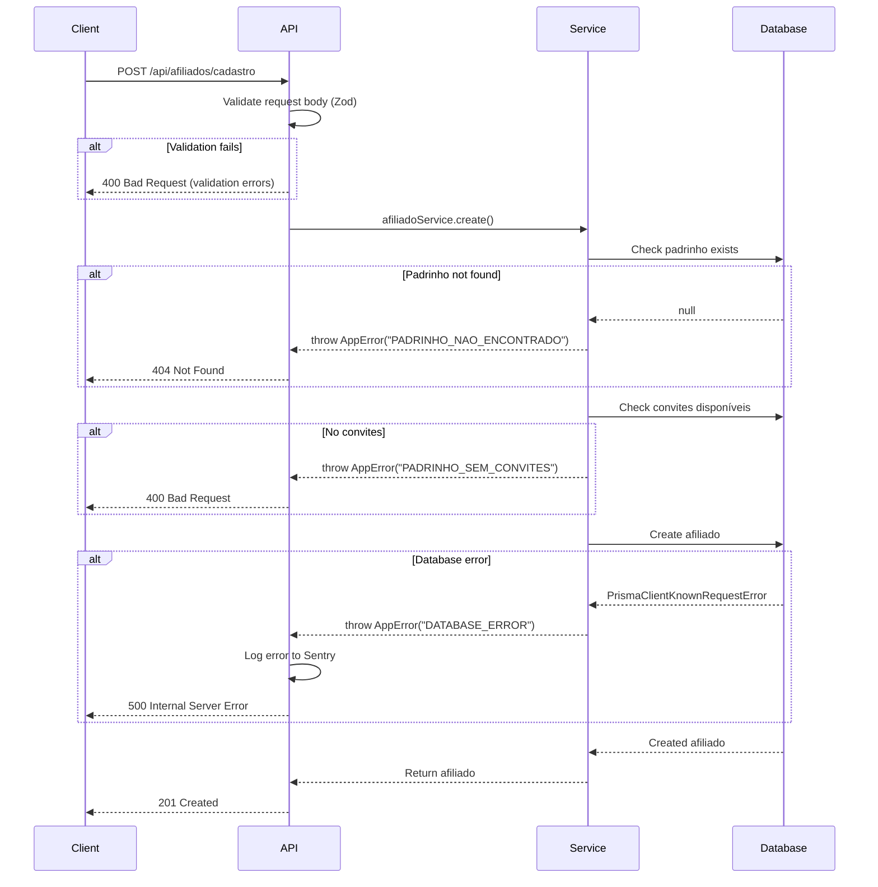

# Error Handling Strategy

## Error Response Format

```typescript
// Standard API error response
interface ApiError {
  error: {
    code: string;           // Machine-readable error code
    message: string;         // Human-readable message
    details?: Record<string, any>; // Additional context
    timestamp: string;       // ISO timestamp
    requestId: string;       // Unique request ID for debugging
  };
}

// Example:
{
  "error": {
    "code": "PADRINHO_SEM_CONVITES",
    "message": "O padrinho não possui convites disponíveis",
    "details": {
      "padrinhoId": "uuid-123",
      "convitesDisponiveis": 0
    },
    "timestamp": "2025-11-01T10:00:00Z",
    "requestId": "req_abc123"
  }
}
```

## Error Flow



## Frontend Error Handling

```typescript
// hooks/use-afiliados.ts
import { useMutation, useQueryClient } from '@tanstack/react-query';
import { apiClient } from '@/lib/api-client';
import { toast } from '@/components/ui/use-toast';

export function useCreateAfiliado() {
  const queryClient = useQueryClient();

  return useMutation({
    mutationFn: (data: AfiliadoCreateInput) =>
      apiClient.post('/afiliados/cadastro', data),

    onSuccess: () => {
      queryClient.invalidateQueries(['afiliados']);
      toast({
        title: 'Sucesso!',
        description: 'Cadastro realizado. Aguarde aprovação.',
        variant: 'success',
      });
    },

    onError: (error: ApiError) => {
      // Map error codes to user-friendly messages
      const messages: Record<string, string> = {
        PADRINHO_NAO_ENCONTRADO: 'O padrinho informado não foi encontrado. Verifique o link de convite.',
        PADRINHO_SEM_CONVITES: 'O padrinho não possui convites disponíveis no momento.',
        EMAIL_JA_CADASTRADO: 'Este email já está cadastrado.',
        VALIDATION_ERROR: 'Verifique os campos do formulário.',
      };

      toast({
        title: 'Erro no cadastro',
        description: messages[error.error.code] || 'Ocorreu um erro. Tente novamente.',
        variant: 'destructive',
      });

      // Log to Sentry if 500 error
      if (error.error.code === 'INTERNAL_SERVER_ERROR') {
        console.error('Server error:', error);
        // Sentry.captureException(error);
      }
    },
  });
}
```

## Backend Error Handling

```typescript
// lib/errors.ts
export class AppError extends Error {
  constructor(
    public code: string,
    public message: string,
    public statusCode: number = 400,
    public details?: Record<string, any>
  ) {
    super(message);
    this.name = 'AppError';
  }
}

// lib/error-handler.ts
import { AppError } from './errors';
import { Prisma } from '@prisma/client';
import * as Sentry from '@sentry/nextjs';

export function handleError(error: unknown): Response {
  const requestId = crypto.randomUUID();

  // Known application errors
  if (error instanceof AppError) {
    return Response.json(
      {
        error: {
          code: error.code,
          message: error.message,
          details: error.details,
          timestamp: new Date().toISOString(),
          requestId,
        },
      },
      { status: error.statusCode }
    );
  }

  // Prisma errors
  if (error instanceof Prisma.PrismaClientKnownRequestError) {
    // P2002: Unique constraint violation
    if (error.code === 'P2002') {
      return Response.json(
        {
          error: {
            code: 'DUPLICATE_ENTRY',
            message: 'Este registro já existe',
            details: { fields: error.meta?.target },
            timestamp: new Date().toISOString(),
            requestId,
          },
        },
        { status: 409 }
      );
    }

    // P2025: Record not found
    if (error.code === 'P2025') {
      return Response.json(
        {
          error: {
            code: 'NOT_FOUND',
            message: 'Registro não encontrado',
            timestamp: new Date().toISOString(),
            requestId,
          },
        },
        { status: 404 }
      );
    }
  }

  // Unknown errors - log to Sentry
  Sentry.captureException(error, {
    tags: { requestId },
  });

  return Response.json(
    {
      error: {
        code: 'INTERNAL_SERVER_ERROR',
        message: 'Ocorreu um erro interno. Tente novamente mais tarde.',
        timestamp: new Date().toISOString(),
        requestId,
      },
    },
    { status: 500 }
  );
}

// Usage in API route
export async function POST(request: Request) {
  try {
    // ... API logic
  } catch (error) {
    return handleError(error);
  }
}
```
