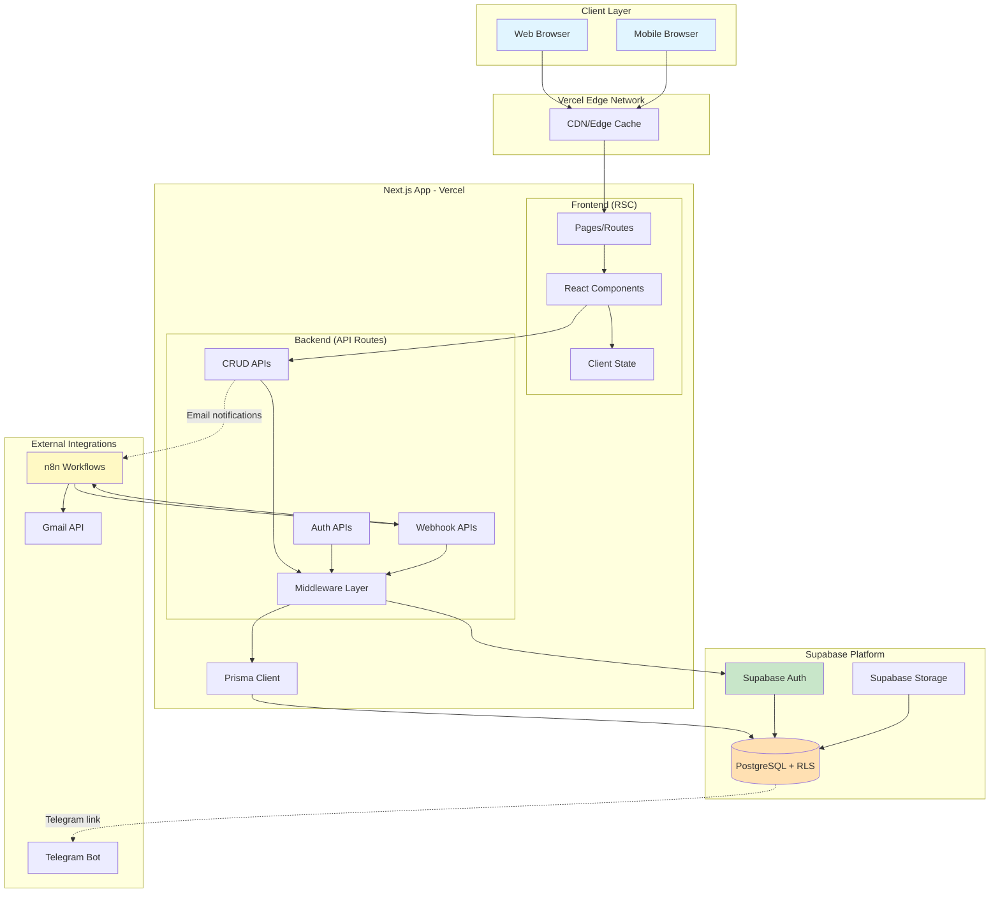

# High Level Architecture

## Technical Summary

nm82 is a **monolithic Next.js fullstack application** deployed on **Vercel**, leveraging Next.js App Router for server-side rendering (SSR) and API Routes for backend logic. The architecture follows a **Jamstack-inspired pattern** with server-rendered pages, serverless API functions, and **Prisma ORM** for type-safe database access to **Supabase PostgreSQL**.

Authentication is handled via **Supabase Auth** with **NextAuth.js** for session management. The frontend uses **React Server Components (RSC)** for optimal performance, with **Shadcn/UI** components styled by **Tailwind CSS**. State management combines **React Query** for server state and **Zustand** for client state.

The system integrates with existing **n8n workflows** via webhooks, preserving email processing and bulk operations while adding a unified admin interface. **Row Level Security (RLS)** on Supabase ensures data isolation by user role, and all sensitive operations are logged for audit compliance.

This architecture achieves PRD goals by providing a secure, performant, and maintainable platform that scales from 100 to 1000+ users while maintaining sub-2-second page loads and 99.5% uptime.

---

## Platform and Infrastructure Choice

**Platform:** Vercel + Supabase
**Key Services:**
- **Frontend & Backend Hosting**: Vercel (Edge Network + Serverless Functions)
- **Database**: Supabase PostgreSQL (managed Postgres with RLS)
- **Authentication**: Supabase Auth + NextAuth.js
- **File Storage**: Supabase Storage (S3-compatible)
- **CDN**: Vercel Edge Network (built-in)
- **Monitoring**: Vercel Analytics + Sentry
- **CI/CD**: GitHub Actions + Vercel Git Integration

**Deployment Host and Regions:**
- **Primary Region**: us-east-1 (Vercel + Supabase)
- **Edge Locations**: Global (Vercel Edge Network)
- **Database Region**: us-east-1 (Supabase)

**Rationale**:
- Vercel provides seamless Next.js deployment with zero-config SSR/API Routes
- Supabase offers Postgres + Auth + Storage in one platform (already in use)
- No vendor lock-in - can migrate to self-hosted if needed
- Cost-effective for MVP stage
- Excellent DX (Developer Experience)

---

## Repository Structure

**Structure:** Monorepo
**Monorepo Tool:** npm workspaces (native, no additional tooling needed)
**Package Organization:**
- `apps/web` - Main Next.js application (frontend + API routes)
- `packages/database` - Prisma schema and migrations
- `packages/shared` - Shared TypeScript types and utilities
- `packages/config` - Shared config files (ESLint, TypeScript, Tailwind)

**Rationale**:
- Simple monorepo structure sufficient for MVP
- Native npm workspaces avoid additional complexity
- Clear separation of concerns
- Shared types ensure frontend/backend consistency
- Easy to add more packages later (e.g., mobile app, admin CLI)

---

## High Level Architecture Diagram

---

## Architectural Patterns

- **Jamstack Architecture:** Server-rendered pages with serverless API functions - _Rationale:_ Optimal performance (SSR) + scalability (serverless) + developer experience

- **API Gateway Pattern:** Next.js API Routes as single entry point - _Rationale:_ Centralized auth, rate limiting, and error handling for all backend operations

- **Repository Pattern:** Prisma models abstracted via service layer - _Rationale:_ Testability, maintainability, and database migration flexibility

- **Component-Based UI:** Reusable React components with TypeScript + Shadcn/UI - _Rationale:_ Type safety, consistency, and rapid development with pre-built components

- **Server-First Data Fetching:** React Server Components + Server Actions - _Rationale:_ Reduced JavaScript bundle size, improved SEO, faster initial page loads

- **Role-Based Access Control (RBAC):** Middleware + RLS for multi-layered security - _Rationale:_ Defense in depth - both application and database enforce permissions

- **Webhook Integration Pattern:** Bidirectional webhooks with n8n - _Rationale:_ Preserve existing automations while adding new capabilities, loose coupling
