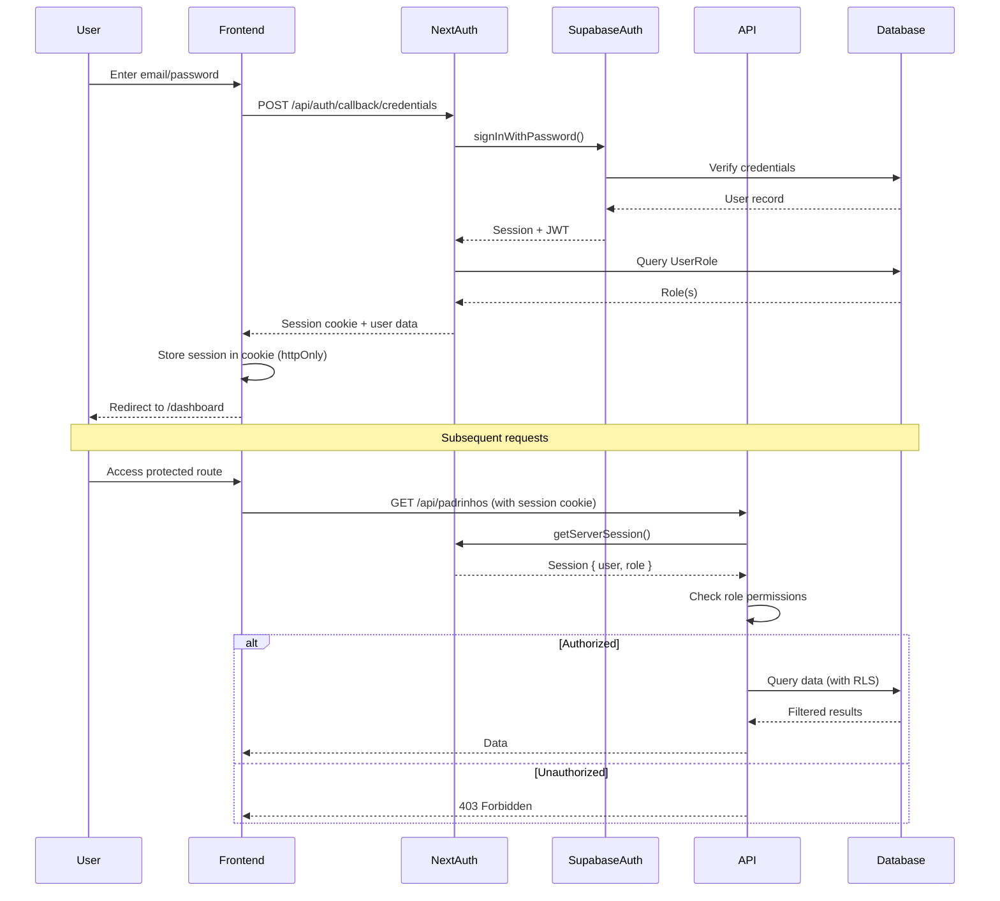

# Security Architecture

## Authentication Flow



## Authorization Model

**Two-Layer Security:**

1. **Application Layer** (Next.js Middleware + API Routes):
   - Middleware checks session existence and role
   - API routes validate specific permissions
   - Service layer enforces business rules

2. **Database Layer** (Supabase RLS):
   - Row Level Security policies filter queries
   - Even if app layer fails, DB enforces access control
   - Defense in depth

**Role Permissions Matrix:**

| Resource | ADMIN | PADRINHO | AFILIADO |
|----------|-------|----------|----------|
| View all afiliados | ✅ | Own only | Own only |
| Approve afiliados | ✅ | ❌ | ❌ |
| Edit padrinho data | ✅ | Own only | ❌ |
| Adjust convites | ✅ | ❌ | ❌ |
| View dashboard | ✅ | Limited | Limited |
| Generate códigos | ✅ | ❌ | ❌ |
| Manage pagamentos | ✅ | ❌ | ❌ |

## Row Level Security (RLS) Policies

```sql
-- Enable RLS on all tables
ALTER TABLE pessoas_fisicas ENABLE ROW LEVEL SECURITY;
ALTER TABLE afiliados ENABLE ROW LEVEL SECURITY;
-- ... repeat for all tables

-- Policy: Admins can see all
CREATE POLICY "Admins can see all pessoas_fisicas"
ON pessoas_fisicas
FOR SELECT
TO authenticated
USING (
  EXISTS (
    SELECT 1 FROM user_roles
    WHERE user_roles.user_id = auth.uid()
    AND user_roles.role = 'ADMIN'
  )
);

-- Policy: Padrinhos can see themselves and their afiliados
CREATE POLICY "Padrinhos can see own record and afiliados"
ON pessoas_fisicas
FOR SELECT
TO authenticated
USING (
  email = (SELECT email FROM auth.users WHERE id = auth.uid())
  OR
  id IN (
    SELECT afiliado_id FROM afiliados
    WHERE padrinho_id = (
      SELECT id FROM pessoas_fisicas
      WHERE email = (SELECT email FROM auth.users WHERE id = auth.uid())
    )
  )
);

-- Policy: Afiliados can see themselves
CREATE POLICY "Afiliados can see own record"
ON pessoas_fisicas
FOR SELECT
TO authenticated
USING (
  email = (SELECT email FROM auth.users WHERE id = auth.uid())
);

-- Policy: Admins can update all
CREATE POLICY "Admins can update all pessoas_fisicas"
ON pessoas_fisicas
FOR UPDATE
TO authenticated
USING (
  EXISTS (
    SELECT 1 FROM user_roles
    WHERE user_roles.user_id = auth.uid()
    AND user_roles.role = 'ADMIN'
  )
);

-- Policy: Padrinhos can update own record
CREATE POLICY "Padrinhos can update own record"
ON pessoas_fisicas
FOR UPDATE
TO authenticated
USING (
  email = (SELECT email FROM auth.users WHERE id = auth.uid())
  AND
  EXISTS (
    SELECT 1 FROM user_roles
    WHERE user_roles.user_id = auth.uid()
    AND user_roles.role = 'PADRINHO'
  )
);

-- ... similar policies for other tables
```

## Authentication Middleware

```typescript
// middleware.ts (Next.js)
import { NextResponse } from 'next/server';
import type { NextRequest } from 'next/server';
import { getToken } from 'next-auth/jwt';

const PUBLIC_ROUTES = ['/login', '/convite'];
const ADMIN_ROUTES = ['/dashboard', '/padrinhos', '/afiliados', '/codigos', '/pagamentos'];
const PADRINHO_ROUTES = ['/portal'];

export async function middleware(request: NextRequest) {
  const { pathname } = request.nextUrl;

  // Allow public routes
  if (PUBLIC_ROUTES.some(route => pathname.startsWith(route))) {
    return NextResponse.next();
  }

  // Check authentication
  const token = await getToken({ req: request, secret: process.env.NEXTAUTH_SECRET });

  if (!token) {
    return NextResponse.redirect(new URL('/login', request.url));
  }

  // Check role-based access
  const role = token.role as string;

  if (ADMIN_ROUTES.some(route => pathname.startsWith(route))) {
    if (role !== 'ADMIN') {
      return NextResponse.json({ error: 'Forbidden' }, { status: 403 });
    }
  }

  if (PADRINHO_ROUTES.some(route => pathname.startsWith(route))) {
    if (role !== 'PADRINHO' && role !== 'ADMIN') {
      return NextResponse.json({ error: 'Forbidden' }, { status: 403 });
    }
  }

  return NextResponse.next();
}

export const config = {
  matcher: ['/((?!api|_next/static|_next/image|favicon.ico).*)'],
};
```

## API Route Authorization Helper

```typescript
// lib/auth-helpers.ts
import { getServerSession } from 'next-auth';
import { authOptions } from '@/app/api/auth/[...nextauth]/route';
import { prisma } from '@/lib/prisma';

export async function requireAuth() {
  const session = await getServerSession(authOptions);
  if (!session) {
    throw new Error('Unauthorized');
  }
  return session;
}

export async function requireRole(allowedRoles: string[]) {
  const session = await requireAuth();

  const userRoles = await prisma.userRole.findMany({
    where: { userId: session.user.id },
  });

  const hasRole = userRoles.some(ur => allowedRoles.includes(ur.role));

  if (!hasRole) {
    throw new Error('Forbidden');
  }

  return { session, roles: userRoles.map(ur => ur.role) };
}

// Usage in API route
// app/api/padrinhos/route.ts
import { requireRole } from '@/lib/auth-helpers';

export async function GET() {
  try {
    await requireRole(['ADMIN']);

    // ... fetch padrinhos

  } catch (error) {
    if (error.message === 'Unauthorized') {
      return Response.json({ error: 'Unauthorized' }, { status: 401 });
    }
    if (error.message === 'Forbidden') {
      return Response.json({ error: 'Forbidden' }, { status: 403 });
    }
    throw error;
  }
}
```
