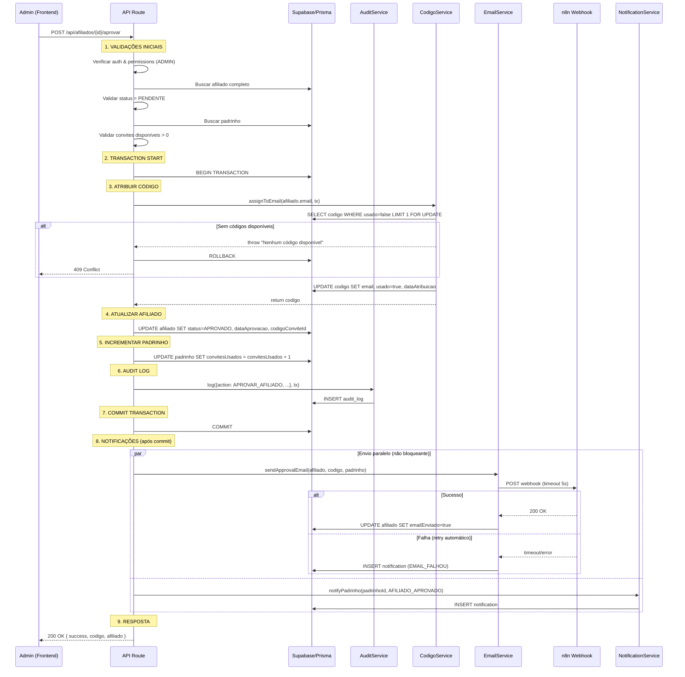

# 📋 Arquitetura - Fluxos RF-003 e RF-004

**Data:** 02/11/2025
**Versão:** 1.0
**Status:** Planejamento Aprovado

---

## 📌 Resumo Executivo

Este documento detalha a arquitetura de implementação dos fluxos críticos:

- **RF-003**: Gestão de Padrinhos (Fase 2)
- **RF-004**: Gestão de Afiliados com Aprovação (Fase 2)

**Objetivo:** Implementar fluxo completo de aprovação de afiliados com garantias de consistência, rastreabilidade e monitoramento.

**Estimativa:** 10-15 dias úteis

**Prioridade:** 🔴 CRÍTICA

---

## 🎯 Escopo

### RF-003: Gestão de Padrinhos
- ✅ Lista de padrinhos (JÁ EXISTE)
- ✅ Edição de dados (JÁ EXISTE)
- ⏳ Ajuste de convites disponíveis
- ⏳ Histórico de afiliados convidados
- ⏳ Filtros avançados (ativo/inativo, com/sem convites)
- ⏳ Ordenação customizada
- ⏳ Export CSV

### RF-004: Gestão de Afiliados
- ✅ Lista de afiliados (JÁ EXISTE)
- ✅ Filtros básicos (JÁ EXISTE)
- ⏳ **Fluxo de Aprovação Completo** ← FOCO
- ⏳ Fluxo de Rejeição com motivo
- ⏳ Aprovação em massa (bulk)
- ⏳ Preview de aprovação
- ⏳ Export CSV

---

## 🔄 Diagrama de Sequência - Fluxo de Aprovação



---

## 📁 Estrutura de Arquivos

### Arquivos Novos a Criar

```
apps/web/src/
├── app/api/
│   ├── afiliados/
│   │   ├── [id]/
│   │   │   ├── aprovar/route.ts           ← REESCREVER
│   │   │   └── rejeitar/route.ts          ← MELHORAR
│   │   ├── aprovar-bulk/route.ts          ← NOVO
│   │   └── export/route.ts                ← NOVO
│   └── padrinhos/
│       ├── [id]/historico/route.ts        ← NOVO
│       └── export/route.ts                ← NOVO
│
├── services/
│   ├── afiliado-service.ts                ← NOVO (principal)
│   ├── email-service.ts                   ← MELHORAR (retry)
│   └── export-service.ts                  ← NOVO
│
├── lib/
│   ├── logger.ts                          ← NOVO (Pino)
│   └── monitoring.ts                      ← NOVO (métricas)
│
└── components/afiliados/
    ├── aprovacao-dialog.tsx               ← NOVO
    ├── rejeicao-dialog.tsx                ← NOVO
    └── aprovacao-bulk-dialog.tsx          ← NOVO
```

---

## ✅ Checklist de Validações

### Aprovação de Afiliado

#### 1. Autenticação e Autorização
- [ ] Usuário autenticado
- [ ] Usuário possui role ADMIN

#### 2. Dados do Afiliado
- [ ] Afiliado existe
- [ ] Status = PENDENTE
- [ ] Email válido
- [ ] Não já aprovado (duplicação)
- [ ] Cadastro completo (nome, email)

#### 3. Padrinho
- [ ] Padrinho existe
- [ ] Padrinho ativo
- [ ] Tem convites disponíveis (enviados > usados)
- [ ] Relação correta (afiliado.padrinhoId = padrinho.id)

#### 4. Códigos de Convite
- [ ] Existem códigos disponíveis no sistema
- [ ] Código não já atribuído ao afiliado

#### 5. Integrações
- [ ] n8n webhook configurado (env var)
- [ ] Supabase disponível

---

## 🎯 Estratégia de Monitoramento

### 1. Logging Estruturado (Pino)

**Biblioteca:** `pino`

**Níveis:**
- `debug`: Etapas internas do fluxo
- `info`: Eventos importantes (aprovação iniciada, código atribuído)
- `warn`: Situações anormais não críticas
- `error`: Erros que exigem ação

**Redact (LGPD):**
- `email`
- `cpf`
- `req.headers.authorization`

**Exemplo de log:**
```json
{
  "level": "info",
  "flow": "APROVAR_AFILIADO",
  "flowId": "abc123",
  "timestamp": "2025-11-02T01:00:00.000Z",
  "msg": "CODIGO_ATRIBUIDO",
  "codigoId": "xyz789",
  "duration": 245
}
```

### 2. Métricas de Performance

**Biblioteca:** Custom `FlowMetrics` class

**Métricas coletadas:**
- `count`: Total de execuções
- `avg`: Tempo médio (ms)
- `min/max`: Melhor/pior caso
- `p95`: 95º percentil (SLA)

**SLA Definido:**
- P95 do fluxo de aprovação < 2 segundos

### 3. Alertas

**Integração:** Webhook n8n

**Eventos que geram alerta:**
- Códigos de convite esgotados (critical)
- Falha em aprovação de afiliado (warning)
- Inconsistência detectada (warning)
- Tempo de aprovação > 5s (info)

---

## ⚠️ Riscos e Mitigações

### Riscos Críticos

| Risco | Probabilidade | Impacto | Mitigação |
|-------|--------------|---------|-----------|
| **Código já atribuído** | Média | Alto | Transaction com SELECT FOR UPDATE<br>Índice único em codigo<br>Validação antes de commit |
| **Padrinho sem convites** | Média | Médio | Validação antes da transaction<br>Lock otimista<br>Preview de aprovação |
| **Falha no envio de email** | Alta | Médio | Envio após commit (não bloqueante)<br>Retry automático (3x)<br>Notificação de falha |
| **Inconsistência de dados** | Baixa | Crítico | Transaction ACID<br>Rollback completo<br>Audit log<br>Job de validação diária |

### Riscos Operacionais

| Risco | Probabilidade | Impacto | Mitigação |
|-------|--------------|---------|-----------|
| **n8n indisponível** | Média | Médio | Timeout 5s<br>Retry assíncrono<br>Fila alternativa |
| **Race condition** | Baixa | Alto | Transaction isolation SERIALIZABLE |
| **Database timeout** | Média | Médio | Batches de 10 afiliados<br>Timeout 30s |

---

## 🔧 Implementação - AfiliadoService

### Método: aprovar()

**Assinatura:**
```typescript
async aprovar(params: {
  afiliadoId: string;
  userId: string;
  userAgent?: string;
  ipAddress?: string;
}): Promise<{
  success: boolean;
  afiliado: Afiliado;
  codigo: CodigoConvite;
}>
```

**Fluxo:**
1. **Validações** (30% do tempo)
   - Buscar afiliado com include de padrinho
   - Validar status, padrinho ativo, convites disponíveis
   - Validar códigos disponíveis no sistema

2. **Transaction** (60% do tempo)
   - Atribuir código (SELECT FOR UPDATE)
   - Atualizar status do afiliado
   - Incrementar convites_usados do padrinho
   - Criar audit log

3. **Notificações** (10% do tempo, assíncrono)
   - Enviar email com retry
   - Notificar padrinho in-app

**Timeout:** 15 segundos

**Isolation Level:** SERIALIZABLE

### Método: aprovarBulk()

**Assinatura:**
```typescript
async aprovarBulk(params: {
  afiliadoIds: string[];
  userId: string;
}): Promise<{
  success: string[];
  failed: Array<{ id: string; reason: string }>;
  warnings: Array<{ id: string; message: string }>;
}>
```

**Fluxo:**
- Processar em batches de 10
- Promise.allSettled para isolamento de erros
- Retry automático em falhas temporárias (max 3x)

---

## 📊 Melhorias Sugeridas

### 1. Preview de Aprovação

**Endpoint:** `GET /api/afiliados/{id}/preview-aprovacao`

**Retorna:**
```json
{
  "afiliado": { "nome": "...", "email": "..." },
  "padrinho": { "nome": "...", "convitesDisponiveis": 10 },
  "codigo": { "disponiveis": 935 },
  "warnings": [
    "Padrinho com poucos convites restantes (10)"
  ],
  "canApprove": true,
  "blockingReasons": []
}
```

### 2. Retry Inteligente de Emails

**Estratégia:**
- 3 tentativas
- Delays: 1s, 3s, 10s (exponential backoff)
- Criar notificação se falhar todas as tentativas
- Marcar `emailEnviado = true` só após sucesso

### 3. Validação de Consistência

**Job diário:** `POST /api/admin/validar-consistencia`

**Verifica:**
- Padrinhos com convitesUsados ≠ COUNT(afiliados aprovados)
- Códigos atribuídos mas sem afiliado relacionado
- Afiliados aprovados sem código

### 4. Export CSV Otimizado

**Usa:**
- Stream processing para grandes volumes
- Limite de 10k registros por export
- Paginação automática

---

## 📅 Cronograma de Implementação

### Fase 1: Fundação (2-3 dias)
- [ ] Setup Pino (logging estruturado)
- [ ] Setup FlowMetrics (monitoramento)
- [ ] Criar AfiliadoService base
- [ ] Testes de validação

### Fase 2: RF-004 - Aprovação (3-4 dias)
- [ ] Reescrever `/api/afiliados/[id]/aprovar`
- [ ] Implementar retry de emails
- [ ] Audit log completo
- [ ] Testes de integração

### Fase 3: RF-004 - Rejeição (1-2 dias)
- [ ] Melhorar `/api/afiliados/[id]/rejeitar`
- [ ] UI de rejeição com motivo
- [ ] Notificações

### Fase 4: RF-003 - Padrinhos (2-3 dias)
- [ ] Histórico de afiliados
- [ ] Filtros avançados
- [ ] Ordenação customizada
- [ ] Export CSV

### Fase 5: Melhorias (2-3 dias)
- [ ] Aprovação em massa
- [ ] Preview de aprovação
- [ ] Validação de consistência
- [ ] Dashboard de métricas

**Total:** 10-15 dias úteis

---

## 🎯 Critérios de Sucesso

### Performance
- [ ] P95 do fluxo de aprovação < 2s
- [ ] P99 < 5s
- [ ] Taxa de sucesso > 99%

### Confiabilidade
- [ ] 0 inconsistências de dados
- [ ] 100% de auditoria (todas aprovações logadas)
- [ ] Taxa de envio de email > 95%

### Observabilidade
- [ ] Logs estruturados em todas as etapas
- [ ] Métricas de performance coletadas
- [ ] Alertas configurados para eventos críticos

### Segurança
- [ ] Apenas ADMIN pode aprovar
- [ ] Audit log completo
- [ ] LGPD compliance (redact de dados sensíveis)

---

## 📚 Referências

- **PRD:** `docs/prd/requisitos-funcionais.md`
- **Integrações:** `docs/prd/integracoes.md`
- **Schema DB:** `packages/database/prisma/schema.prisma`
- **Código Atual:** `apps/web/src/app/api/afiliados/`

---

## 🔗 Links Úteis

- Prisma Transactions: https://www.prisma.io/docs/orm/prisma-client/queries/transactions
- Pino Logger: https://getpino.io/
- React Query: https://tanstack.com/query/latest

---

**Criado por:** Arquiteto + Claude
**Aprovado por:** [Pendente]
**Última Revisão:** 02/11/2025
