# nm82 MVP Epics

**Product Owner**: Sarah
**Version**: 1.0
**Date**: 2025-11-01
**Scope**: MVP (Phases 1 + 2)

---

## Epic Overview

The MVP is divided into **6 major epics** that deliver the foundational features of nm82. These epics align with the PRD phases and enable the elimination of 90% of manual operations.

### Epic Priority Legend
- 🔴 **P0 (Critical)**: Must complete for MVP launch
- 🟡 **P1 (High)**: Should complete for full MVP functionality
- 🟢 **P2 (Medium)**: Nice to have, can be deferred

---

## EPIC-001: Project Foundation & Infrastructure
**Priority**: 🔴 P0
**Phase**: Foundation (Phase 1)
**Duration**: 1 week
**Dependencies**: None

### Description
Set up the technical foundation for the nm82 project, including repository structure, development environment, database setup, and core configurations.

### Goals
- Create Next.js 14+ monorepo with TypeScript
- Configure Prisma ORM with Supabase connection
- Set up Shadcn/UI and Tailwind CSS
- Configure development and staging environments
- Establish CI/CD pipeline basics

### Acceptance Criteria
- [ ] Next.js app runs locally on http://localhost:3000
- [ ] Prisma connects to Supabase successfully
- [ ] Tailwind CSS and Shadcn/UI components work
- [ ] Environment variables configured (dev + staging)
- [ ] README with setup instructions exists
- [ ] GitHub repository initialized with .gitignore

### Technical Requirements (from Architecture)
- Monorepo structure: `apps/web`, `packages/database`, `packages/shared`, `packages/config`
- Package manager: npm with workspaces
- TypeScript 5.3+, Next.js 14.2+
- Prisma 5.x connected to Supabase PostgreSQL

### User Stories
- As a developer, I can clone the repo and run `npm install && npm run dev` to start the app
- As a developer, I can run Prisma migrations to create database tables
- As a developer, I have access to pre-configured UI components from Shadcn/UI

### Related PRD Requirements
- RNF-005: Manutenibilidade (README, TypeScript)
- Arquitetura de Alto Nível (Next.js + Prisma + Supabase)

---

## EPIC-002: Authentication & Authorization System
**Priority**: 🔴 P0
**Phase**: Foundation (Phase 1)
**Duration**: 1-2 weeks
**Dependencies**: EPIC-001

### Description
Implement secure authentication using Supabase Auth + NextAuth.js, with role-based access control (Admin, Padrinho, Afiliado) enforced at both application and database layers.

### Goals
- Implement login/logout flow with email/password
- Create user roles system (Admin, Padrinho, Afiliado)
- Apply Row Level Security (RLS) policies in Supabase
- Protect routes with Next.js middleware
- Create password recovery flow

### Acceptance Criteria
- [ ] User can sign up with email/password
- [ ] User can log in and receive JWT token in httpOnly cookie
- [ ] User can log out and session is destroyed
- [ ] User can recover password via email
- [ ] Middleware protects authenticated routes (/dashboard, etc.)
- [ ] Admin role can access /dashboard
- [ ] Padrinho role can access /portal (future)
- [ ] RLS policies applied to all database tables
- [ ] Audit logs capture login/logout events

### Technical Requirements
- NextAuth.js 5.x for session management
- Supabase Auth for user database
- Prisma `UserRole` model to map users to roles
- Middleware checks JWT token and role
- RLS policies in SQL (see architecture)

### User Stories
- **US-001**: As a user, I can log in with my email and password
- **US-002**: As a user, I can recover my password if I forget it
- **US-003**: As an admin, I can access all admin features after logging in
- **US-004**: As a padrinho, I cannot access admin-only pages (receive 403 error)
- **US-005**: As the system, I enforce RLS so users can only see their own data

### Related PRD Requirements
- **RF-001**: Autenticação e Autorização
- **RNF-002**: Segurança (HTTPS, JWT, RLS)

### Related Architecture Sections
- Security Architecture (RLS policies, middleware)
- Authentication Flow diagram

---

## EPIC-003: Admin Dashboard & Metrics
**Priority**: 🔴 P0
**Phase**: Foundation (Phase 1)
**Duration**: 1-2 weeks
**Dependencies**: EPIC-002

### Description
Build the admin dashboard with real-time metrics, charts, and navigation to core management features. This serves as the central command center for administrators.

### Goals
- Create dashboard layout with sidebar navigation
- Display key metrics (afiliados, padrinhos, receita, convites)
- Show charts for trends (afiliados/day, receita/week)
- Display recent activity tables
- Show alerts for pending actions

### Acceptance Criteria
- [ ] Admin sees dashboard at /dashboard after login
- [ ] Dashboard shows 4 metric cards: Total Afiliados, Total Padrinhos, Receita Total, Convites Disponíveis
- [ ] Dashboard shows line chart of "Novos Afiliados" (last 30 days)
- [ ] Dashboard shows bar chart of "Receita por Semana" (last 12 weeks)
- [ ] Dashboard shows table of "Últimos 10 Afiliados" with status
- [ ] Dashboard shows table of "Top 10 Padrinhos" by convites usados
- [ ] Dashboard shows alerts for: afiliados pendentes, códigos expirados, pagamentos pendentes
- [ ] Data refreshes every 30 seconds (React Query)
- [ ] Sidebar navigation to Padrinhos, Afiliados, Códigos, Pagamentos

### Technical Requirements
- React Server Components for initial page load
- React Query for client-side data fetching
- Recharts for charts visualization
- Shadcn/UI Card, Table components
- API Routes: `/api/dashboard/metrics`, `/api/dashboard/afiliados-por-dia`, `/api/dashboard/receita-por-semana`, `/api/dashboard/ranking-padrinhos`

### User Stories
- **US-006**: As an admin, I see the total number of afiliados, padrinhos, and receita on the dashboard
- **US-007**: As an admin, I see a graph of new afiliados over the last 30 days
- **US-008**: As an admin, I see a graph of revenue per week for the last 12 weeks
- **US-009**: As an admin, I see the most recent 10 afiliados that registered
- **US-010**: As an admin, I see the top 10 padrinhos by number of invites used
- **US-011**: As an admin, I see alerts for pending approvals and expired codes
- **US-012**: As an admin, I can click on sidebar links to navigate to other sections

### Related PRD Requirements
- **RF-002**: Dashboard Administrativo
- **RNF-001**: Performance (< 2s page load, < 1s dashboard refresh)

### Related Architecture Sections
- Components & Services (Dashboard components, API routes)
- Frontend Components structure

---

## EPIC-004: Padrinhos & Afiliados Management
**Priority**: 🔴 P0
**Phase**: Core Management (Phase 2)
**Duration**: 2-3 weeks
**Dependencies**: EPIC-003

### Description
Implement CRUD operations for Padrinhos and Afiliados, including the critical approval workflow that automates the onboarding of new affiliates.

### Goals
- Create Padrinhos list and detail pages
- Enable editing padrinho data and adjusting convites
- Create Afiliados list with filtering by status
- Implement afiliado approval/rejection workflow
- Automate código assignment on approval
- Send notifications on approval

### Acceptance Criteria

**Padrinhos:**
- [ ] Admin sees paginated list of padrinhos (20/page)
- [ ] Admin can search padrinhos by name or email
- [ ] Admin can filter padrinhos by: ativo/inativo, with/without convites
- [ ] Admin can sort padrinhos by: nome, convites usados, data cadastro
- [ ] Admin clicks padrinho to see detail page with full data + afiliados list
- [ ] Admin can edit padrinho data (nome, email, cpf, etc.)
- [ ] Admin can adjust "convites disponíveis" for a padrinho
- [ ] Admin can activate/deactivate a padrinho
- [ ] Admin can export padrinhos list to CSV

**Afiliados:**
- [ ] Admin sees paginated list of afiliados (20/page)
- [ ] Admin can search afiliados by name, email, or padrinho name
- [ ] Admin can filter by status: PENDENTE, APROVADO, REJEITADO
- [ ] Admin can sort by: data cadastro, nome, status
- [ ] Admin clicks afiliado to see detail page with padrinho info
- [ ] Admin can approve afiliado (individual or bulk)
- [ ] On approval: system assigns available código, increments padrinho's convites_usados, sends email (via n8n), creates notifications
- [ ] Admin can reject afiliado with a reason (motivo)
- [ ] On rejection: system records motivo, sends rejection email
- [ ] Admin can export afiliados list to CSV

### Technical Requirements
- Prisma queries with pagination, filtering, sorting
- React Hook Form + Zod for forms
- Shadcn/UI Table, Dialog, Form components
- API Routes: `/api/padrinhos`, `/api/padrinhos/:id`, `/api/padrinhos/:id/ajustar-convites`, `/api/afiliados`, `/api/afiliados/:id`, `/api/afiliados/:id/aprovar`, `/api/afiliados/:id/rejeitar`
- Service layer: `afiliadoService.aprovar()` with transaction
- Webhook call to n8n for email sending
- Audit logs for approval/rejection/convite adjustment

### User Stories
- **US-013**: As an admin, I see a list of all padrinhos with their convites info
- **US-014**: As an admin, I can search for a padrinho by name or email
- **US-015**: As an admin, I can increase the convites disponíveis for a padrinho
- **US-016**: As an admin, I see a list of afiliados filtered by PENDENTE status
- **US-017**: As an admin, I can click "Aprovar" on a pendente afiliado
- **US-018**: As the system, when admin approves an afiliado, I assign a código, update padrinho convites, send email, and log the action
- **US-019**: As an admin, I can reject an afiliado and provide a reason
- **US-020**: As an admin, I can bulk-approve multiple afiliados at once
- **US-021**: As an admin, I can export the afiliados list to CSV for analysis

### Related PRD Requirements
- **RF-003**: Gestão de Padrinhos
- **RF-004**: Gestão de Afiliados

### Related Architecture Sections
- API Specification (Padrinhos, Afiliados endpoints)
- Components & Services (Service layer pattern, transaction logic)
- Data Models (PessoaFisica, Afiliado)

---

## EPIC-005: Códigos de Convite Management
**Priority**: 🟡 P1
**Phase**: Core Management (Phase 2)
**Duration**: 1 week
**Dependencies**: EPIC-004

### Description
Enable admins to generate, manage, and track códigos de convite (Telegram access codes) used for approved afiliados.

### Goals
- Display list of códigos with status
- Generate códigos in batches
- Show which email is using each código
- Allow liberating códigos (reset for reuse)
- Display statistics (total, disponíveis, usados, expirados)

### Acceptance Criteria
- [ ] Admin sees list of códigos with columns: código, status (disponível/usado/expirado), email, data atribuição, data expiração
- [ ] Admin can filter by status: disponível, usado, expirado
- [ ] Admin clicks "Gerar Códigos" button
- [ ] Admin enters quantity (e.g., 100) and optional expiration days (default 90)
- [ ] System generates unique 8-character alphanumeric codes
- [ ] Admin sees summary stats: Total, Disponíveis, Usados, Expirados
- [ ] Admin can click "Liberar" on a used código to reset (email = null, usado = false)
- [ ] System marks códigos as expired if dataExpiracao < now (via scheduled job or query)

### Technical Requirements
- Prisma `CodigoConvite` model
- Code generation function: `generateCodigo()` (8 chars, alphanumeric, unique)
- API Routes: `/api/codigos`, `/api/codigos/gerar`, `/api/codigos/:id/liberar`
- Shadcn/UI Table, Dialog for generation form
- Scheduled job (future) or DB query to mark expired codes

### User Stories
- **US-022**: As an admin, I see all códigos with their status and assigned email
- **US-023**: As an admin, I can generate 100 new códigos with a 90-day expiration
- **US-024**: As an admin, I see statistics showing how many códigos are available vs used
- **US-025**: As an admin, I can liberate a used código if it was assigned in error
- **US-026**: As the system, I mark códigos as expired if their expiration date has passed

### Related PRD Requirements
- **RF-005**: Gestão de Códigos de Convite

### Related Architecture Sections
- API Specification (Códigos endpoints)
- Data Models (CodigoConvite)

---

## EPIC-006: Public Afiliado Cadastro (Signup Form)
**Priority**: 🔴 P0
**Phase**: Foundation (Phase 1)
**Duration**: 1 week
**Dependencies**: EPIC-002, EPIC-004

### Description
Migrate the existing public signup form from the fragmented nm81 system to a secure, integrated page within nm82 that validates padrinho and creates afiliado records.

### Goals
- Create public route `/convite` accessible without authentication
- Accept `?pid={padrinhoId}` query parameter
- Validate padrinho exists, is active, and has convites available
- Collect afiliado data via form
- Create afiliado record with status PENDENTE
- Send confirmation email to afiliado
- Notify admin of new cadastro

### Acceptance Criteria
- [ ] Visitor accesses `https://inema.vip/convite?pid={padrinho_id}`
- [ ] System validates padrinhoId exists, is active, and has convites > 0
- [ ] If invalid: show error "Link de convite inválido ou expirado"
- [ ] If valid: show signup form with fields: nome (required), email (required), cpf (optional), data nascimento, sexo, cidade, uf, nicho atuação
- [ ] Form validates: email format, CPF format (if filled), required fields
- [ ] On submit: system creates PessoaFisica + Afiliado (status PENDENTE, linked to padrinho)
- [ ] System sends confirmation email: "Cadastro recebido! Aguarde aprovação."
- [ ] System creates notification for ADMIN: "Novo afiliado cadastrado"
- [ ] Visitor sees success message: "Cadastro realizado! Você receberá um email quando for aprovado."
- [ ] If email already exists: show error "Este email já está cadastrado"

### Technical Requirements
- Public route (no auth required)
- API Route: `/api/afiliados/cadastro` (PUBLIC)
- React Hook Form + Zod validation
- Prisma transaction: create PessoaFisica + Afiliado
- Webhook call to n8n for confirmation email
- Notification service call

### User Stories
- **US-027**: As a visitor, I receive a convite link from a padrinho and can access the signup page
- **US-028**: As a visitor, I see an error if the convite link is invalid or expired
- **US-029**: As a visitor, I fill out the signup form with my information
- **US-030**: As a visitor, I receive immediate feedback if I enter invalid data (email format, CPF format)
- **US-031**: As a visitor, I see a success message after submitting the form
- **US-032**: As a visitor, I receive a confirmation email after signing up
- **US-033**: As an admin, I receive a notification when a new afiliado signs up
- **US-034**: As the system, I prevent duplicate emails by showing an error if email exists

### Related PRD Requirements
- **RF-010**: Cadastro Público de Afiliado
- **RNF-002**: Segurança (validate input, no exposed credentials)

### Related Architecture Sections
- API Specification (Public cadastro endpoint)
- Security (public route, input validation)
- Components & Services (Form components)

---

## Epic Dependencies Diagram

```mermaid
graph TD
    E001[EPIC-001: Foundation] --> E002[EPIC-002: Auth]
    E002 --> E003[EPIC-003: Dashboard]
    E003 --> E004[EPIC-004: Padrinhos/Afiliados]
    E004 --> E005[EPIC-005: Códigos]
    E002 --> E006[EPIC-006: Public Signup]
    E004 --> E006

    style E001 fill:#ffcccc
    style E002 fill:#ffcccc
    style E003 fill:#ffcccc
    style E004 fill:#ffcccc
    style E005 fill:#ffffcc
    style E006 fill:#ffcccc
```

**Color Legend:**
- Red: P0 (Critical)
- Yellow: P1 (High)

---

## MVP Completion Criteria

The MVP is considered complete and ready for launch when:

- [ ] All **P0 epics** (EPIC-001 to EPIC-006) are completed
- [ ] All acceptance criteria for each epic are met
- [ ] Test coverage >70% (unit + integration tests)
- [ ] E2E tests cover critical flows:
  - Login
  - Approve afiliado
  - Public signup
- [ ] Performance benchmarks met:
  - Dashboard loads < 2s
  - API responses < 500ms (p95)
  - Lighthouse score > 90
- [ ] Security review passed:
  - RLS policies tested with different roles
  - No credentials exposed in frontend
  - Input validation on all forms
- [ ] UAT completed with 5 admins for 1 week
- [ ] Sentry configured for error tracking
- [ ] Production deployment successful
- [ ] Staging environment matches production configuration

---

## Next Steps

1. **Break down each epic into detailed user stories** (20-30 stories total)
2. **Estimate story points** using Fibonacci scale (1, 2, 3, 5, 8, 13)
3. **Create sprint plan** (2-week sprints)
4. **Set up project in GitHub Projects** or Jira
5. **Transform to Dev (Sam)** to begin implementation with EPIC-001

---

**Epic definitions complete!** Ready to proceed to Sprint Planning and Development.
